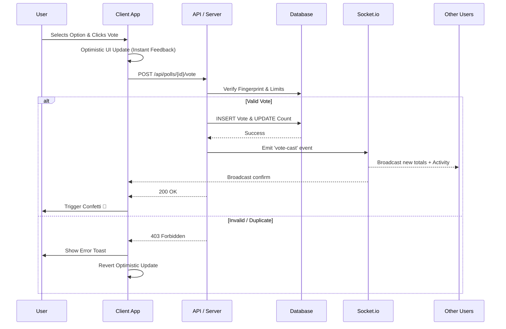

# 🌊 Pollflow Realtime


**Pollflow** is a next-generation polling platform that delivers **instant, real-time feedback** without the friction of sign-ups. Designed for speed, engagement, and accessibility, it transforms how audiences interact during events, meetings, and streams.

🌐 **Live Demo:** [pollflow-theta.vercel.app](https://pollflow-theta.vercel.app)

---

## ⚡ Key Features

- **🚀 Instant & Anonymous**: No login required. Uses advanced browser fingerprinting for secure, unique voting.
- **⚡ Real-Time Updates**: Watch vote bars grow and rankings change instantly across all devices using **Socket.io**.
- **📱 PWA & Mobile First**: Installable on iOS/Android. Optimized touch targets, haptic feedback, and offline support.
- **🎨 Premium UX**:
  - **Confetti Celebrations** 🎉 on every vote.
  - **Smart Suggestions** 🪄 that auto-complete common poll options.
  - **Dynamic Visuals** shaped by `framer-motion` and smooth transitions.
- **🕵️‍♀️ Live Presence**: See exactly how many people are viewing the poll right now.
- **📊 Analytics Dashboard**: Track views, votes, and conversion rates with beautiful charts.
- **📅 Smart Scheduling**: Schedule polls to open in the future or auto-expire at a set time.
- **🔗 Universal Sharing**: QR Codes, social links, and a dedicated **Presentation Mode** for big screens.

---

## 🏗️ System Architecture

Pollflow utilizes a hybrid architecture combining **Supabase** for persistent storage and **Socket.io** for ephemeral real-time events, hosted on a custom Next.js server.


---

## 🔄 User Workflow: The Voting Journey



---

## 🛠️ Technology Stack

| Component | Technology | Description |
|-----------|------------|-------------|
| **Frontend** | Next.js 15 (App Router) | React Server Components, SSR, and SEO optimization. |
| **Styling** | Tailwind CSS + Shadcn UI | Rapid UI development with accessible, beautiful components. |
| **Animations** | Framer Motion | Complex layout animations and micro-interactions. |
| **Real-time** | Socket.io | Bi-directional communication for live updates. |
| **Database** | Supabase (PostgreSQL) | Reliable relational data storage. |
| **Security** | FingerprintJS | Client-side device identification for abuse prevention. |
| **PWA** | Custom Service Worker | Offline capabilities and "Add to Home Screen". |

---

## 🚀 Getting Started

1.  **Clone the repository:**
    ```bash
    git clone https://github.com/Anubhab-Rakshit/pollflow.git
    cd pollflow/
    ```

2.  **Install dependencies:**
    ```bash
    npm install
    ```

3.  **Set up Environment Variables:**
    Create a `.env.local` file:
    ```env
    NEXT_PUBLIC_SUPABASE_URL=your_supabase_url
    NEXT_PUBLIC_SUPABASE_ANON_KEY=your_supabase_key
    ```

4.  **Run the development server:**
    ```bash
    npm run dev
    ```

5.  **Open in browser:**
    Navigate to `http://localhost:3000`.

---

## 📱 Mobile Experience

Pollflow is designed to feel native on your phone.
- **No Zoom**: Inputs are sized perfectly to prevent iOS auto-zoom.
- **Haptics**: Subtle vibrations when you interact (supported devices).
- **Offline**: View loaded polls even without an internet connection.

---

## ☁️ Deployment

Pollflow is optimized for **Vercel**.

### Vercel Configuration
- **Build Command:** `npm run build`
- **Output Directory:** `.next` (default)
- **Install Command:** `npm install`

### Environment Variables
Ensure you add these to your Vercel Project Settings:
- `NEXT_PUBLIC_SUPABASE_URL`
- `NEXT_PUBLIC_SUPABASE_ANON_KEY`
- `NEXT_PUBLIC_SITE_URL` (e.g., `https://your-project.vercel.app`)

Since we use **Supabase Realtime**, no separate WebSocket server is needed. Everything works serverless! 🚀

---

> Built with ❤️ by [Your Name/Team] for [Hackathon/Project Name]
